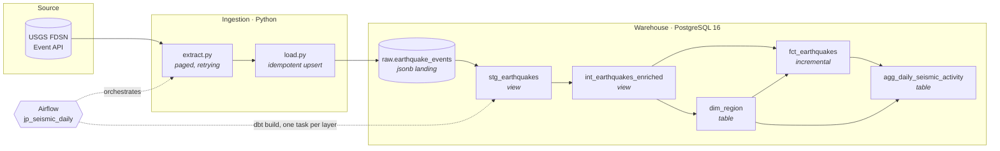

# Japan Seismic Activity Pipeline

[](https://github.com/DelusionsMaxxing/jp-seismic-pipeline/actions/workflows/ci.yml)
[](https://www.python.org/)
[](https://www.getdbt.com/)
[](https://airflow.apache.org/)
[](LICENSE)

A production-shaped ELT pipeline that ingests every seismic event recorded in
and around the Japanese archipelago, lands it as immutable raw JSON, and
models it into a tested dimensional warehouse with dbt — orchestrated by
Airflow, reproducible with one `docker compose up`.

Japan records several thousand locatable earthquakes a year across a bounding
box spanning four converging tectonic plates. That makes it a genuinely
awkward dataset: events arrive out of order, magnitudes get revised days
after the fact, and place labels are free text. Those are the problems this
pipeline is built to handle, not to assume away.

---

## Architecture



The split is deliberate: **Python only moves bytes, dbt does all the
thinking.** Nothing between the API and the landing table interprets the
payload, so an upstream schema change can never destroy data that has already
been captured — it becomes a modelling problem, fixable with a `dbt run`
rather than a re-ingest of history.

## Data model

| Model | Grain | Materialisation | Purpose |
|---|---|---|---|
| `stg_earthquakes` | one event | view | Casts and renames the GeoJSON payload. No business logic. |
| `int_earthquakes_enriched` | one event | view | Derives region, depth band, magnitude band, JST calendar date. |
| `dim_region` | one region | table | Conformed region dimension with a hashed surrogate key. |
| `fct_earthquakes` | one event | incremental | Event fact, joined to `dim_region`. |
| `agg_daily_seismic_activity` | day × region | table | Daily counts and magnitude statistics on JST. |

**5 models, 27 data tests, 1 source freshness check.**

### Sample query

```sql
-- The ten most seismically active days on record, by damaging events
select
    activity_date,
    region_name,
    event_count,
    damaging_event_count,
    max_magnitude
from analytics_marts.agg_daily_seismic_activity
where is_onshore_japan
order by damaging_event_count desc, max_magnitude desc
limit 10;
```

## Design decisions

Judgement calls worth defending, and why they went the way they did.

**Raw JSONB landing rather than a typed insert.** Parsing at ingest time means
an unexpected field type crashes the loader and the event is lost. Landing
the feature whole and parsing in `stg_earthquakes` means a bad assumption
costs a `dbt run`, not a backfill.

**A seven-day incremental lookback, not "rows newer than max".** USGS
publishes an automatic solution within minutes and replaces it with a
reviewed one for days afterwards. A naive high-watermark filter would freeze
the first, least accurate estimate forever. `fct_earthquakes` reprocesses on
`updated_at`, so revisions land.

**`delete+insert` over `merge`.** Postgres has no native `MERGE` path in dbt's
incremental strategies that beats it here, and the volume — thousands of rows
per run, not millions — makes the simpler strategy the right trade.

**Aggregating on Asia/Tokyo, not UTC.** A report about Japan that splits a
21:00 JST event into the previous day is wrong in the only way that matters
to the reader. `occurred_on_jst` is computed once in the intermediate layer
so no downstream consumer has to remember.

**Idempotent upsert keyed on the USGS event id.** Re-running any window is
safe, which is what makes both Airflow retries and `dags backfill` usable
without a deduplication step.

**Regions derived, not seeded.** USGS place strings are free text
(`"148 km E of Miyako, Japan"`). There is no upstream region reference to
join to, so the dimension's grain is defined by what is actually observed —
and `is_offshore` is inferred rather than pretended to be authoritative.

## Running it

Requires Docker and Docker Compose. Nothing else, and no API key — the USGS
FDSN endpoint is open.

```bash
git clone https://github.com/DelusionsMaxxing/jp-seismic-pipeline.git
cd jp-seismic-pipeline
cp .env.example .env
make up
```

Airflow comes up on <http://localhost:8080> (`admin` / `admin`). The
`jp_seismic_daily` DAG is unpaused on creation and runs at 03:00 UTC — late
enough that the previous UTC day has closed and most solutions are reviewed.

Trigger a run immediately, or backfill history:

```bash
docker compose exec airflow-scheduler airflow dags trigger jp_seismic_daily
```

```bash
docker compose exec airflow-scheduler \
    airflow dags backfill jp_seismic_daily -s 2024-01-01 -e 2024-04-01
```

`dags/` and `dbt/` are bind-mounted, so edits there take effect on the next DAG
parse. `src/` is not — it is copied into the image and installed there — so a
change to the Python package needs `docker compose build` before the containers
run it.

### Without Docker

```bash
make install
make backfill START=2024-01-01 END=2024-02-01
make build
```

### Useful targets

```
make up        Start Postgres, scheduler, webserver and the monitoring stack
make demo      Load fixture events instead of calling the API
make build     Run every dbt model and its tests
make test      Run the Python unit tests
make monitor   Print the monitoring endpoints
make backup    Dump the warehouse into backups/
make restore   Restore a dump: make restore FILE=backups/seismic-....dump
make docs      Generate and serve the dbt documentation site
make clean     Stop the stack and delete data volumes
```

On Windows there is no `make`; run the underlying `docker compose` commands
directly, or use Git Bash with GNU Make installed.

### Backups

`make clean` deletes the data volume, and the raw layer is the only thing in
this stack that cannot be rebuilt from somewhere else — dbt models are derived,
and Airflow's metadata is disposable. So the dump covers the warehouse
database, in Postgres custom format:

```bash
make backup
```

Restoring is the same command in reverse, and is worth rehearsing once before
you need it rather than the first time you need it:

```bash
make restore FILE=backups/seismic-20260809T210000.dump
```

## Monitoring

`make up` brings up Prometheus and Grafana alongside the pipeline. Grafana is
on <http://localhost:3000> (`admin` / `admin` by default) with the **JP Seismic
Pipeline** dashboard provisioned in the *Pipelines* folder — no clicking
required, and no dashboard state that a rebuild would lose.

Metrics arrive from three places:

| Source | Route | What it answers |
| --- | --- | --- |
| The ingest job | `prometheus_client` → Pushgateway | rows read, written, rejected, run duration, time of last success |
| Airflow | StatsD → `statsd-exporter` | task successes and failures, DAG run duration, scheduler heartbeat |
| Postgres | `postgres_exporter` | is the warehouse reachable, connection and transaction stats |

Ingest is a batch job that exits, so it **pushes** rather than being scraped.
The push is optional: with `PUSHGATEWAY_URL` unset the pipeline runs exactly as
before and simply publishes nothing, which is what keeps CI and laptop runs
free of a monitoring dependency.

The dashboard reads the warehouse directly for freshness and volume panels,
through a `seismic_readonly` role that holds `SELECT` and nothing else.

### Alerting

The rules in `monitoring/prometheus/rules/` cover the failures that matter: no
successful ingest in 36 hours, a failed run, rejected rows appearing, the
warehouse unreachable, and the Airflow scheduler going quiet. Prometheus
evaluates them and hands anything firing to **Alertmanager**
(<http://localhost:9093>), which groups, deduplicates and silences them — and
inhibits the downstream ingest alerts while the warehouse itself is down, so a
single outage pages once rather than five times.

Alertmanager ships with no notification integration configured: alerts are
visible and silenceable in its UI and inside Grafana, but nothing leaves the
host until a `telegram_configs`, `slack_configs` or `email_configs` block is
added to `monitoring/alertmanager/alertmanager.yml`. Tokens belong in a
`*_file` mount, never in that file.

Everything above is provisioned from files under `monitoring/`, so a dashboard
or alert change arrives as a reviewable diff rather than as somebody's edit in
a UI.

## Testing

Three layers, all enforced in CI on every push:

- **Unit tests** (`pytest`) cover the parts that are easy to get quietly
  wrong: FDSN's 1-based paging offsets, `204` as an empty window rather than
  an error, backfill windows that tile a range without gaps or overlap, and
  batching in the loader — all with the network mocked.
- **Warehouse tests** (`dbt build`) run against a real PostgreSQL service
  container seeded with fixtures. CI runs `dbt build` **twice** so the
  incremental branch of `fct_earthquakes` is exercised, not just the
  first-run path that a single build would cover.
- **The compose smoke test** (`.github/workflows/compose-smoke.yml`) is the
  check that guards the first-run experience. It does what this README's
  opening section says — `cp .env.example .env`, `make up`, `make demo` — then
  runs the DAG's own `dbt_run` and `dbt_test` tasks inside the scheduler
  container and asserts every mart came out non-empty. The other two layers
  install dbt on the runner and never start the stack, so they cannot see a
  broken image, a bind mount shadowing the vendored `dbt_packages`, or a
  scheduler that crash-loops on first start.

```bash
make test && make build
```

## Project layout

```
├── dags/
│   └── jp_seismic_daily.py        Airflow DAG; derives its window from the data interval
├── src/jp_seismic/
│   ├── config.py                  Bounding box, endpoint, DB and metrics config from env
│   ├── extract.py                 Paged, retrying FDSN client
│   ├── load.py                    Batched idempotent upsert
│   ├── metrics.py                 Run metrics pushed to Prometheus
│   └── cli.py                     Entrypoint shared by the DAG and manual backfills
├── dbt/models/
│   ├── staging/                   Casting and renaming only
│   ├── intermediate/              Derived classifications
│   └── marts/                     dim / fct / agg
├── monitoring/
│   ├── prometheus/                Scrape config and alert rules
│   ├── grafana/                   Datasources and the provisioned dashboard
│   └── statsd/                    Airflow StatsD → Prometheus mapping
├── sql/
│   ├── init/                      Warehouse DDL and monitoring grants, applied on first start
│   └── fixtures/                  Sample payloads for CI and `make demo`
├── tests/                         Unit tests, network mocked
└── .github/
    ├── workflows/ci.yml           Lint, unit tests, dbt build, monitoring config checks
    ├── workflows/compose-smoke.yml  First run of the real stack, end to end
    └── workflows/release.yml      Image build and publish, on a tag only
```

## Possible extensions

- Cross-reference JMA's shindo (震度) intensity scale, which measures ground
  shaking where people actually are, rather than energy at the hypocentre.
- Add a `dbt snapshot` on `fct_earthquakes` to keep the full revision history
  of each magnitude estimate instead of only its current value.
- Publish `agg_daily_seismic_activity` to a BI layer; the model is already
  shaped for it.

## Data source

[USGS Earthquake Hazards Program](https://earthquake.usgs.gov/fdsnws/event/1/),
public domain. This project is not affiliated with USGS or JMA, and is not
suitable for any operational or safety-critical purpose.

## License

MIT — see [LICENSE](LICENSE).
